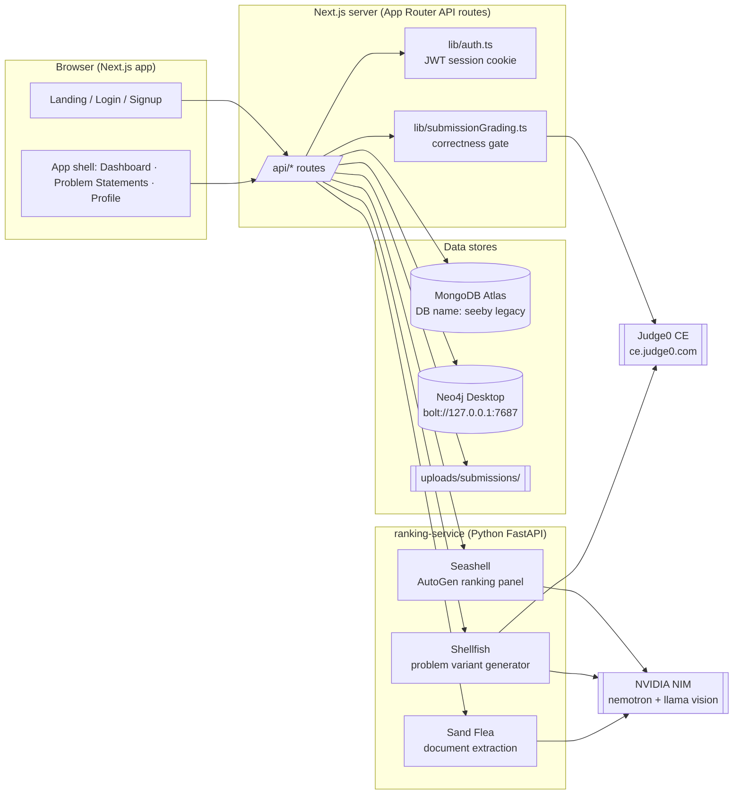
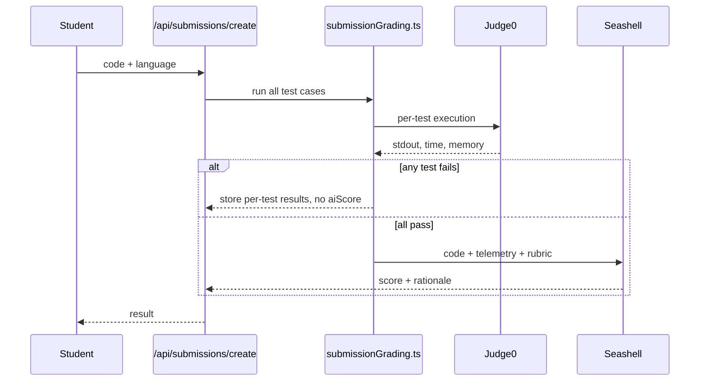

# ARCHITECTURE — TACET

**Purpose:** How the system is built: components, data, APIs, auth, grading, and AI pipeline.
**Last updated:** 2026-09-21
**Read this when:** you are changing backend code, adding a route or model, debugging a flow, or onboarding an agent.

> **Source note.** Reconstructed from the project's build history, not from a fresh scan of the repo. Facts I am confident about are stated plainly. Anything path-, field- or name-level that I could not confirm is marked `UNVERIFIED`. Env vars are listed **by name only**. Never paste values into docs.

---

## 1. System overview



## 2. Tech stack

| Layer | Choice | Notes |
|---|---|---|
| Web app | Next.js (App Router), TypeScript | Exact Next version `UNVERIFIED` (check `package.json`) |
| Styling | Tailwind CSS v4 | v4 does **not** read `tailwind.config.js` unless linked with `@config`; tokens live in `@theme` in `globals.css` |
| Fonts | `next/font`: Melodrame (local), Instrument Serif, Geist, Geist Mono | Melodrame file is gitignored (see MEMORY) |
| Auth | JWT via `jose`, HTTP-only cookie | `lib/auth.ts`, constants in `lib/constants/auth.ts` |
| Primary DB | MongoDB Atlas (Mongoose models) | DB name `seeby` (legacy, do not rename) |
| Graph DB | Neo4j Desktop | Synced from Mongo (e.g. `syncSubmission()`, `lib/graphSync.ts`) |
| AI service | Python FastAPI, AutoGen | `ranking-service/` |
| LLM | NVIDIA NIM `nvidia/nemotron-3-nano-omni-30b-a3b-reasoning` (Seashell, Shellfish), `meta/llama-3.2-11b-vision-instruct` (Sand Flea vision fallback) | Earlier local Ollama fallback tested and dropped |
| Code sandbox | Judge0 CE (public) | Piston kept only as optional fallback for a self-hosted instance |
| OCR | Tesseract | Fallback before the vision model |
| Editor | CodeMirror | Student coding UI |
| Landing visuals | Three.js / R3F / Rapier (lanyard), WebGL dither, `DecryptedText` | Landing only |
| Export | `html2canvas` + canvas draws | Wrapped and lanyard card exports |
| QR | `qrcode` npm package | Class join QR |
| Browser tests | Playwright | Used for verification passes |

## 3. Repository map

`UNVERIFIED` at file level; folders are as referenced in the project history.

| Path | What lives there |
|---|---|
| `app/` | Pages and API routes (App Router). `app/api/**/route.ts` |
| `app/providers.tsx` | `AuthProvider`. Revalidates session on load via `/api/user/profile`; localStorage key `tacet_user` |
| `components/` | UI. `pages/problem-statements.tsx` is the big role-aware page (student, hiring manager, mentor) |
| `components/pages/` | Page-level components (`about-tacet.tsx`, `wrapped-dashboard.tsx`, `profile.tsx`, ...) |
| `components/card-template.tsx` | Lanyard card canvas draw |
| `lib/auth.ts` | `requireAuth()`, session create/clear, JWT sign/verify |
| `lib/constants/auth.ts` | `AUTH_COOKIE_NAME = 'tacet_session'`, `AUTH_STORAGE_KEY = 'tacet_user'` |
| `lib/submissionGrading.ts` | Shared correctness-gate pipeline (normal + auto-promoted submissions) |
| `lib/graphSync.ts` | Mongo → Neo4j sync ("syncing" is the English verb here, not a brand leftover) |
| `lib/email.ts` | **Console-log stub**; no real email |
| `lib/mongo-problem-validator.ts` | `$jsonSchema` validator for the problems collection |
| `lib/mongodb.ts`, `lib/neo4j.ts` | Connection helpers |
| `models/` | Mongoose models |
| `ranking-service/` | `main.py`, `agents.py`, `sand_flea.py` |
| `scripts/` | Verification and seed scripts (many use the legacy `seeby` DB name and `syncin@TEST...` fixtures) |
| `public/fonts/` | `melodrame.ttf` (gitignored demo font) |
| `uploads/` | Uploaded submission files (`uploads/submissions/`); gitignored |

## 4. Auth and sessions

- **Login:** `POST /api/user/login` verifies credentials, sets `tacet_session` (HttpOnly, SameSite=lax, Secure). Response body is `{ username, role }`. The client stores a display cache in localStorage (`tacet_user`).
- **Never trust the client.** Every route calls `requireAuth()`/`getSession()`. A repo-wide audit found zero routes trusting caller-supplied identity, **except** possibly the community POST route (see Known gaps).
- **Session revalidation:** `AuthProvider` calls `GET /api/user/profile` on load to re-derive role from the server. (`GET /api/user/me` exists but is unused by the provider.)
- **Logout:** `POST /api/user/logout` clears the cookie **and** sets `User.loggedOutAt`. Any token with `iat < loggedOutAt` is rejected, so logout is global across devices.
- **JWT secret:** `JWT_SECRET` env var is required; the hardcoded fallback was removed and the app throws if it is missing.
- **Legacy cookie** `sebby_session` is no longer read. Everyone was logged out once at the rename (expected).
- **Roles:** `student`, `hiring_manager`, `mentor`. Students and mentors carry `collegeId`; hiring managers carry `companyId`.
- **Profile ID prefix:** new IDs `tacet@`, legacy `syncin@`. Parse with `/^(syncin|tacet)@/`.

## 5. Data model

### 5.1 MongoDB (Mongoose)

Collection names below are Mongoose defaults and `UNVERIFIED`. Field lists are what the history confirms; check `models/` for the full schema.

| Model | Key fields / rules |
|---|---|
| **User** | `profileId`, `username`, `role`, `passwordHash` (never returned), `collegeId` (string, e.g. `CAMPUS_DEFAULT`), `collegeName`, `companyId`, `emailVerified`, `loggedOutAt`, profile fields (full name, college, branch, year, skills[], avatarUrl), reset/recovery fields (never returned). **Known smell:** for hiring managers `collegeName` historically held the company name |
| **Company** | `name`, `logoUrl`, `website`, `description`. Onboarding required before a hiring manager can post |
| **Problem** | `problemType: 'company' \| 'class_assignment'`, `postedByRole: hiring_manager \| mentor`, `format` (open-ended / coding), `gradingMode: 'stdin_stdout' \| 'function_signature'` (default `stdin_stdout`), test cases (hidden ones filtered for students), `referenceSolution` (`select:false`), variants + rubric/dataset, `collegeId`/`companyId`/`classId` scope, and optional `collegeIds[]` targeting for company problems. Missing/empty `collegeIds` means all colleges. Validated by `$jsonSchema` |
| **Submission** | Unique index `{problemId, studentId}`. `content` (optional), `fileUrl`, `fileType`, `extractedContent`, per-test-case results, `aiScore` + rationale (absent on gate-failed submissions), sandbox telemetry (time/memory) |
| **DbProblem** | `dbType: 'sql' \| 'mongodb'`, seed data, `expectedResult` and `referenceQuery` (both `select:false`), `collegeId` is a **String**, and optional `collegeIds[]` targeting for company problems |
| **DbSubmission** | Unique index `{problemId, studentId}`. Deterministic grading result |
| **Class** | Mentor-owned, college-scoped, unique `classId`, hashed password, generated QR |
| **ClassMembership** | Unique per class+student; status `pending \| approved \| rejected` |
| **CodingTest / TestSession** | Server-side start time, `draftCode`, deadline, `autoPromoted` / `autoPromotionReason` |

### 5.2 Neo4j

Problem and submission nodes are synced from Mongo (`syncSubmission()`, plus problem sync in `lib/graphSync.ts`). Full node labels and relationship types are `UNVERIFIED`.

## 6. API surface

This inventory was generated from the current filesystem (`app/api/**/route.ts` and `pages/api/**/*.ts`). “Auth” means the file calls `requireAuth()` or `getSession()`; it does not certify role or ownership checks. Model names are the imported Mongoose models, and all listed file-backed models currently exist under `models/` unless marked inline.

| Methods | Path | Auth | Models touched |
|---|---|---|---|
| POST | `/api/classes/[classId]/join` | yes | Class, ClassMembership |
| POST | `/api/classes/[classId]/requests/[studentId]/approve` | yes | Class, ClassMembership |
| POST | `/api/classes/[classId]/requests/[studentId]/reject` | yes | Class, ClassMembership |
| POST | `/api/classes/[classId]/requests/approve-all` | yes | Class, ClassMembership |
| GET | `/api/classes/[classId]/requests` | yes | Class, ClassMembership |
| GET | `/api/classes/[classId]/students/[studentId]/overview` | yes | Class, ClassMembership, DbProblem, DbSubmission, Problem, Submission, User |
| POST | `/api/classes/create` | yes | Class |
| GET | `/api/classes` | yes | Class, ClassMembership |
| GET | `/api/company/me` | yes | Company |
| POST | `/api/company/onboard` | yes | Company |
| GET | `/api/db-problems/[problemId]` | yes | DbProblem |
| POST | `/api/db-problems/[problemId]/preview` | student | DbProblem (read-only preview) |
| POST | `/api/db-problems/create` | yes | Company, DbProblem |
| POST | `/api/db-submissions/create` | yes | DbProblem, DbSubmission |
| GET | `/api/db-submissions/for-problem/[problemId]` | yes | DbProblem, DbSubmission, User |
| GET | `/api/db-submissions/mine` | yes | DbProblem, DbSubmission |
| GET | `/api/healthcheck` | no | — |
| GET | `/api/problems/[id]` | yes | Problem |
| POST | `/api/problems/create-with-variants` | yes | Company, Problem |
| POST | `/api/problems/create` | yes | Class, Company, Problem |
| GET | `/api/problems` | yes | DbProblem, DbSubmission, Problem, Submission |
| GET | `/api/colleges` | yes | User (distinct student/mentor college IDs) |
| GET | `/api/stats/hiring-manager` | yes | DbProblem, DbSubmission, Problem, Submission |
| GET | `/api/stats/mentor` | yes | DbProblem, DbSubmission, Problem, Submission |
| GET | `/api/stats/student` | yes | DbProblem, DbSubmission, Problem, Submission, User |
| POST | `/api/submissions/create` | yes | ClassMembership, Problem, Submission, TestSession |
| GET | `/api/submissions/for-problem/[problemId]` | yes | Problem, Submission, User |
| GET | `/api/submissions/mine` | yes | Submission |
| POST | `/api/submissions/rank/[problemId]` | yes | Problem, Submission |
| POST | `/api/submissions/run` | yes | Problem |
| POST | `/api/test-sessions/auto-promote` | yes | TestSession |
| PATCH | `/api/test-sessions/draft` | yes | TestSession |
| POST | `/api/test-sessions/start` | yes | ClassMembership, Problem, TestSession |
| POST | `/api/user/forgot-password` | no | User |
| POST | `/api/user/login` | no | User |
| POST | `/api/user/logout` | yes | User |
| GET | `/api/user/me` | yes | — |
| GET / PATCH | `/api/user/profile` | yes | User |
| POST | `/api/user/recover-credentials/request` | no | User |
| POST | `/api/user/recover-credentials/verify` | no | User |
| POST | `/api/user/register` | no | CollegeCommunity, User |
| POST | `/api/user/resend-verification` | yes | User |
| POST | `/api/user/reset-password` | no | User |
| POST | `/api/user/verify-email` | no | User |
| GET | `/uploads/[...path]` | yes | Submission, Problem (submissions only) |

`/api/pages-router` does not exist in the current filesystem. The file-backed uploads are written by `/api/company/onboard` and `/api/submissions/create`, then served by `/uploads/[...path]`; serving requires authentication and applies the existing submission ownership scopes.

For `GET /api/problems`, students receive only `{ id, title, format, companyName, className, postedAt }`, scoped to targeted company problems or approved same-college class assignments. `GET /api/problems/[id]` and `GET /api/db-problems/[problemId]` apply the same scope; student responses never include answer keys, hidden tests, rubrics, or dataset internals. Hiring managers and mentors retain the existing management list shape.

`POST /api/db-problems/[problemId]/preview` accepts `{ query }` for an authorized, visible student problem and returns `{ success, results, error }`. It does not create a Submission or DbSubmission and never loads referenceQuery/expectedResult. SQL previews use the same read-only validator and SQLite `PRAGMA query_only`; Mongo previews use the existing rejected-operator checks and ephemeral `tmp_eval_*` collection path. `DbProblemEditor` renders the read-only schema/collection browser, CodeMirror query editor, Run preview output, and inline errors; Submit remains the existing graded path.

DbProblem creation accepts the existing `schemaDefinition` string. The form can populate it from one CSV file (one SQL table: inferred `int|float|date|text` columns plus generated DDL/inserts) or one JSON array (Mongo documents), with a 2 MB / 1,000-row cap, editable inferred types, and a first-10-row preview. Manual seed-definition entry remains available.

### ranking-service (FastAPI, internal)

| Endpoint | Purpose |
|---|---|
| `/extract-document` | Sand Flea: PDF/PPTX/DOCX/image → text |
| ranking endpoint | Seashell scoring. Path `UNVERIFIED` |
| variant-generation endpoint | Shellfish. Path `UNVERIFIED` |

## 7. Grading pipelines

### 7.1 Coding (stdin/stdout)



Judge0 language IDs in use: Python 71, Java 62, C 50, C++ 54. Java requires `public class Main` (flagged in the UI).

### 7.2 Function-signature grading (Java only)

A generated harness with a hand-rolled JSON parser (Judge0 has no network) deserializes typed inputs, calls the student's function, serializes the return value and compares to `expectedOutput`. Doubles: 1e-6 tolerance. Everything else: exact match.

### 7.3 SQL

Python stdlib `sqlite3`, ephemeral `:memory:` DB seeded per run. Two write-protection layers: keyword/statement blocklist plus `PRAGMA query_only = 1`.

### 7.4 MongoDB queries

Ephemeral `tmp_eval_<id>` collections on the existing Atlas connection, dropped in `finally`. Student input is parsed as JSON filter/pipeline and passed to the native driver, never `eval()`. Dangerous operators such as `$where` are rejected. Optional `SANDBOX_MONGODB_URI` to isolate later.

### 7.5 Principle

**Never trust the LLM's asserted correct output.** Shellfish writes a reference solution and executes it in the sandbox to produce expected outputs. A failing candidate test gets one regeneration, then is dropped.

## 8. AI pipeline

| Agent | Job | Details |
|---|---|---|
| **Seashell** | Rank submissions | AutoGen panel: Technical, Business, Originality, Judge. Technical evaluator uses real sandbox telemetry for coding |
| **Shellfish** | Brief → problem variants | Ingestion + Variant Generator agents; 3 retries then `generationFailed: true` (excluded from assignment); coding test cases via reference solution |
| **Sand Flea** | Document extraction | Direct text → Tesseract OCR → vision model for diagrams |

Variant assignment: `sha256(studentId:problemId)`, first 8 hex chars, mod variant count.

## 9. Environment variables (names only)

`UNVERIFIED` complete list. Confirmed or implied by the code history:

| Name | Used for |
|---|---|
| `MONGODB_URI` | Atlas connection |
| `SANDBOX_MONGODB_URI` | Optional isolated Mongo for query grading (designed, not required) |
| `NEO4J_*` (URI/user/password) | Neo4j connection |
| `JWT_SECRET` | Session signing (required, no fallback) |
| NVIDIA NIM key | Seashell/Shellfish/Sand Flea calls (exact name `UNVERIFIED`) |
| Judge0 URL/key | Grading sandbox (exact names `UNVERIFIED`) |
| Ranking-service URL | Next → FastAPI (exact name `UNVERIFIED`) |

## 10. Running locally

```
npm install
npm run build && npm run start      # or npm run dev
# ranking-service: start the FastAPI app from ranking-service/ (exact command UNVERIFIED)
# Neo4j Desktop must be running on bolt://127.0.0.1:7687
```

Test account used in scripts: `syncin@TESTSTUDENT1` (password lives in scripts; do not copy it into docs).

## 11. Known gaps and trade-offs

| Item | Status |
|---|---|
| Public Judge0 has rate limits and shared tenancy | Open. Self-host before real load |
| Mongo query grading shares the production cluster | Accepted for now |
| Python and C++ function-signature grading | Not built |
| `lib/email.ts` stub | Open |
| Community POST author identity | Fixed in current route: `authorProfileId` is taken from `session.profileId`; the body only supplies validated `content` (the route has no in-repo callers). |
| HM signup writes company name into `collegeName` | Partly mitigated by `Company` model; cleanup pending |
| Tesseract weak on low-res handwriting | Accepted |
| Shellfish variants still use a uniform "You are the [C-level] at [Company]" opener | Accepted model-quality ceiling |
| Auto-promotion is opportunistic (checked on next API call), not a background job | By design |
| Upload files are local filesystem storage and are not durable across stateless deployments | Open; move to object storage before multi-instance production |
| Upload serving validates path containment, symlinks, ownership, headers, and file signatures | Fixed in the upload hardening commit |

## 12. What to revisit as it grows

1. Self-hosted Judge0 and queueing for grading bursts.
2. Background jobs (ranking, auto-promotion, email) instead of request-time work.
3. Isolating query-grading databases.
4. Multi-tenant boundaries per college once more than one college is onboarded.
5. Observability: structured logs, error tracking, per-agent latency and cost.
6. A real migration plan if the DB name `seeby` and `syncin.vercel.app` ever change.
