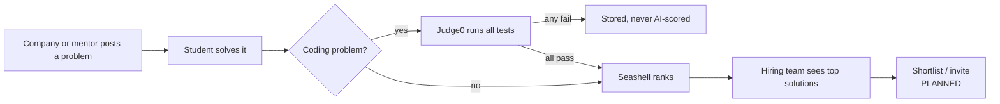
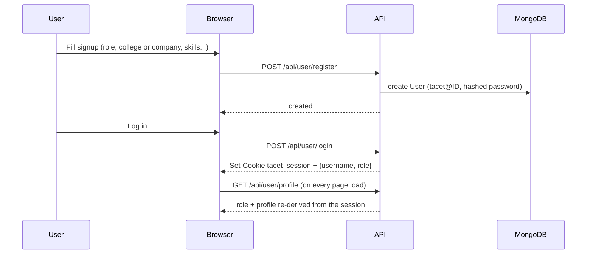
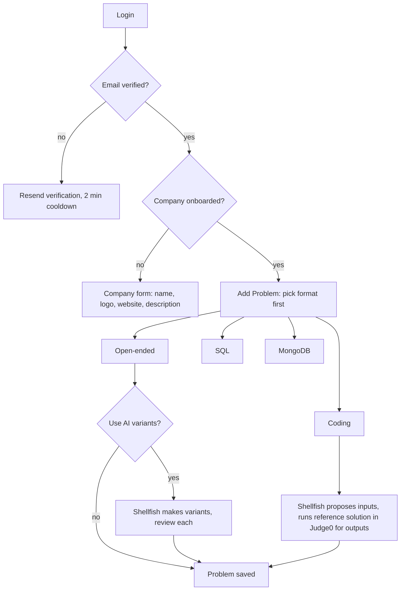
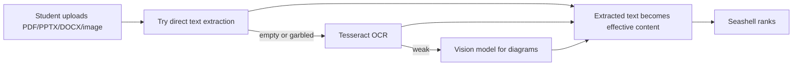
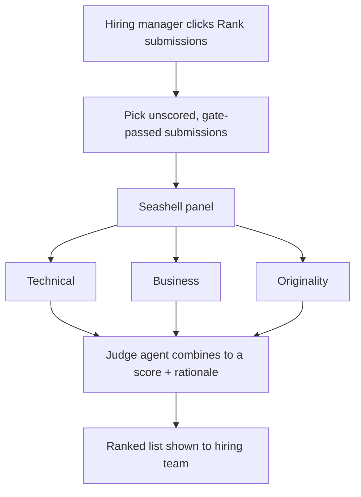
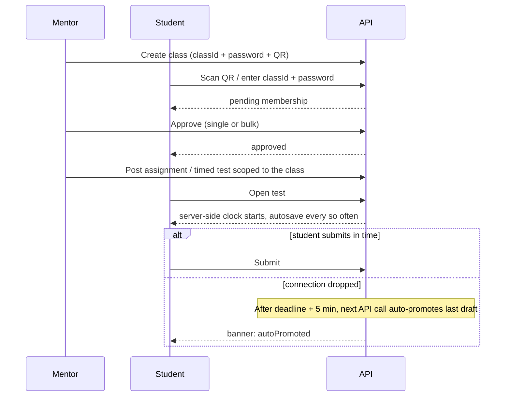
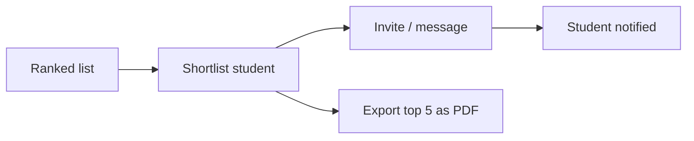
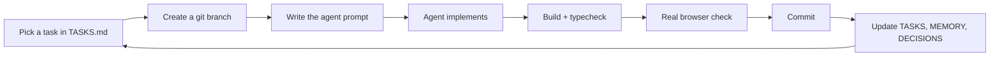

# FLOW — TACET

**Purpose:** How the product flows work end to end, and how *you* work with AI coding agents day to day.
**Last updated:** 2026-09-21
**Read this when:** you want to understand what happens when someone clicks something, or you are about to start a new task with an agent.

---

# Part A — Product flows

## A1. The core loop (30-second version)



## A2. Signup and login



Hiring managers and mentors must **verify email** before posting. Hiring managers must also finish **company onboarding**. Both are enforced on the server, not just hidden in the UI.

## A3. Hiring manager posts a problem



Failed variants show as red-bordered cards and are **excluded** from student assignment.

## A4. Student submits (coding)

1. Student opens a problem. They get a CodeMirror editor and a language picker (Python, Java, C, C++).
2. **Run** executes visible test cases only. Nothing is stored.
3. **Submit** runs all tests (including hidden) and creates a real submission. Duplicate submit returns 409.
4. Correctness gate: if any test fails, the submission is stored with per-test results and **never sent to AI**.
5. If all pass, Seashell scores it. The Technical evaluator sees real execution time and memory.

## A5. Student submits (open-ended, with a file)



One submission is a file **or** text, not both.

## A6. AI ranking (Seashell)



"No unscored submissions" is a normal, handled state, not an error.

## A7. Database problems (SQL / MongoDB)

Separate from coding. Deterministic grading against a reference query run on seeded data. **No AI ranking.** The mentor/hiring manager sees these in a separate "Database Submissions" panel. Stats dashboards count them but keep AI-score fields Submission-only.

## A8. Mentor classes and timed tests



Class assignments are open only to students of the mentor's **own college** (others get 403).

## A9. Planned flows

### Company shortlist (PLANNED)



### College / HOD dashboard (PLANNED)

Participation, top students, active companies, problems solved, per-department breakdown. This is what the college is paying for.

### Public student page (PLANNED)

`tacet.../username` shows solved problems, scores and (opt-in) code. Public by student choice.

---

# Part B — How you and AI agents work together

## B1. The loop



## B2. Rules of thumb

1. **One task per prompt.** Small commits are easy to undo.
2. **Point the agent at the docs first:** "Read docs/MEMORY.md and docs/RULES.md before you start."
3. **Commit before you start** so you can roll back.
4. **Insist on evidence.** "Build passed" is not proof a feature works. Ask for a real browser run or a real API response.
5. **Fonts, cookies, DB names, env values are dangerous.** Say explicitly what must not change.
6. **Never let an agent print `.env` files.**
7. **Keep separate concerns in separate commits** (rebrand vs fonts vs features).

## B3. Reusable prompt template

```
Task: <one sentence>

Read first: docs/MEMORY.md, docs/RULES.md, docs/ARCHITECTURE.md (sections: <which>).

Goal / acceptance criteria:
- <observable outcome 1>
- <observable outcome 2>

Constraints:
- Do not touch: <DB names, env values, unrelated files>
- Never print secrets or .env contents.
- Follow docs/RULES.md.

Verify (show evidence, not claims):
- npm run build passes, typecheck has 0 errors
- Real browser/API test of: <flows>
- Screenshot or logged response of the result

Finish by:
- Listing every file changed
- Adding any durable gotcha to docs/MEMORY.md
- Updating docs/TASKS.md status
- Stop and wait for my next instruction
```

## B4. Definition of done

- [ ] Acceptance criteria met, shown with evidence
- [ ] `npm run build` and typecheck pass with zero errors
- [ ] Tested in a real browser or with real API calls, including one failure case
- [ ] Auth check present on every new route; role and ownership scoped
- [ ] No secrets in code, logs, or docs
- [ ] No unrelated files changed (`git diff --stat` reviewed)
- [ ] Committed with a clear message
- [ ] `TASKS.md` updated; `MEMORY.md` and `DECISIONS.md` updated if something durable was learned or decided

## B5. Which tool for what

| Situation | Use |
|---|---|
| Multi-file feature work | Coding agent (Cursor, Antigravity, Claude Code, ...) with the prompt template |
| Planning, prompts, reviewing outputs, docs | This chat |
| Quick check or grep | Whatever is open |

Both Antigravity and Cursor have hit usage limits recently. Keep prompts self-contained so you can move a task between tools without losing context. The docs folder is what makes that possible.
